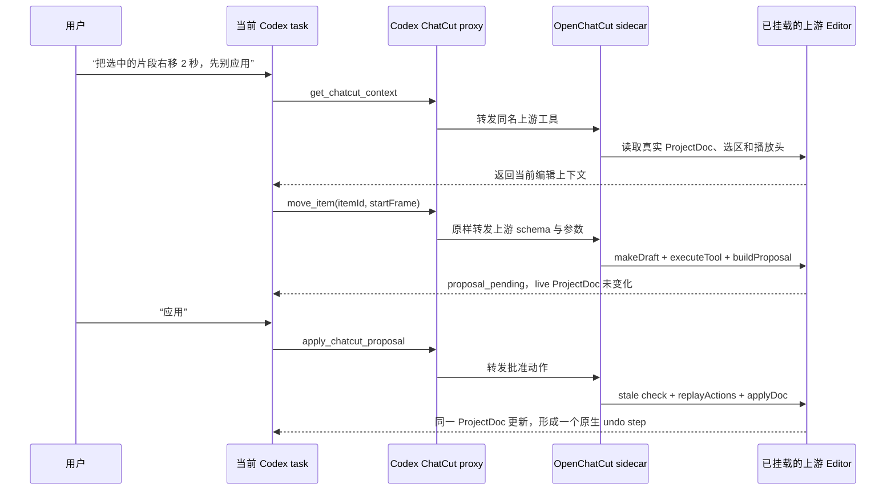
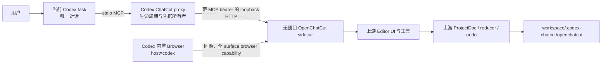

# Codex ChatCut

在 Codex 里使用真正的 [OpenChatCut](https://github.com/0xsline/OpenChatCut) 编辑器，同时让当前 Codex task 成为唯一对话。

> [!IMPORTANT]
> 这是 `francize` 维护的**非官方 downstream 源码 MVP**，与 OpenChatCut、ChatCut 或 OpenAI 没有隶属或背书关系。它还不是已审计的二进制发行版；固定 upstream 加 7 个 Host Patch（patch digest `8e4d35724c8dbc6ade2b1e37008f0a4b7afdf700b652f88315a9177ed77cda29`）已通过真实 Codex Desktop 内置 Browser 验收。

Codex ChatCut 不重写时间线、项目模型或媒体管线。仓库把 OpenChatCut 固定在 [`850c238b894c2b0138ffc7944e8c7e2c30156fcd`](https://github.com/0xsline/OpenChatCut/commit/850c238b894c2b0138ffc7944e8c7e2c30156fcd)，对该版本应用小而可审查的 Host Patch，然后以无窗口 sidecar 方式运行它。

## 用户看到什么

- 所有自然语言指令、解释和批准都留在当前 Codex task。
- 编辑画面在 Codex 内置 Browser 中打开，不会启动 OpenChatCut Electron 窗口。
- Library、Preview、Inspector、Timeline、项目持久化、媒体 Range 请求、预览/导出等仍走上游实现。
- `host=codex` 下的 OpenChatCut `ChatPanel` **不是折叠或 CSS 隐藏**，而是连同分隔栏、provider/model 设置和 chat seed 回调一起不挂载。
- Codex 通过上游工具、`ProjectDoc`、`EditorCommands`、proposal actions 和原生 undo 操作同一个项目，不维护第二份时间线状态。

一次典型使用是：

1. 在 Codex task 中调用 `$open-chatcut`。
2. 插件启动当前 workspace 专属的 OpenChatCut sidecar，并选择或创建上游项目。
3. Codex 在内置 Browser 打开无凭据的 `http://127.0.0.1:<port>/?host=codex#/editor/<project-id>`。
4. 你可直接在编辑器里手动操作；也可让 Codex 读取当前选区/播放头，生成上游原生 proposal。
5. Codex 在 task 中说明影响，得到批准后才 apply；需要恢复时走 OpenChatCut 原生 undo。

## Codex 是怎样和 OpenChatCut 交互的

这里**不是让 OpenChatCut 再调用一次 OpenAI API**。Codex 本身就是 agent；插件只把 OpenChatCut 已有的编辑工具接到当前 task。实际有两段 MCP 通道：Codex 到本插件走 stdio，本插件再用私有 bearer 连接 sidecar 的上游 HTTP MCP。工具名、JSON Schema、结果和编辑语义仍来自 OpenChatCut。这条 Codex 控制路径不会发起第二次模型对话；但如果用户另行配置并显式调用 OpenChatCut 自带的 provider-backed 生成工具，该工具仍可能访问对应服务商；这不是 Codex 与编辑器之间的 agent 交互通道。



换句话说，`move_item` 不是我们重写的移动逻辑：它进入 OpenChatCut 的 `executeTool -> EditorCommands -> reducer` 路径。我们新增的只是“把这个调用从 Codex 安全送到已挂载编辑器”以及“批准前先用上游 proposal primitives 在 draft 上预演”这两层胶水。

## 为什么不是 MCP Widget

在本项目调研的 Codex Desktop `26.715.31925` 中，生产 host 会过滤 MCP Widget iframe 的 HTTP localhost frame origin，因此 Widget 不能可靠承载真实的 loopback OpenChatCut 页面。Codex 内置 Browser 能打开 localhost，同时仍留在 Codex 应用内；它是当前官方插件边界下可工作的编辑表面，而不是另一个跨平台 App。

这里借鉴 [Cowart](https://github.com/zhongerxin/Cowart) 的宿主与生命周期模式：skill 启动 workspace-scoped 本地服务，再把真正的创作界面打开到 Codex 内置 Browser。本仓库没有复制 Cowart 的编辑器代码、状态模型或工具；视频编辑的状态、UI 和工具仍全部来自 OpenChatCut。

这项选择不放宽 localhost 安全边界：编辑 URL 不携带 bearer 或 browser capability，stdio MCP 代理和浏览器桥使用分离的随机能力，sidecar 只监听 `127.0.0.1` 的随机端口。详见 [SECURITY.md](SECURITY.md) 和 [ADR 0001](docs/adr/0001-openchatcut-sidecar.md)。

## 架构



| 层 | 本仓库负责 | 直接复用 OpenChatCut |
| --- | --- | --- |
| Codex 集成 | plugin manifest、`$open-chatcut` skill、stdio proxy | 上游 MCP tool schema 和 structured result |
| 进程 | workspace 绑定、启动/停止、随机能力、日志脱敏 | windowless embedded server 组成 |
| 编辑器 | `host=codex` 开关与 Browser 打开流程 | Library、Preview、Inspector、Timeline、ProjectDoc |
| 编辑 | proposal 编排与批准边界 | draft/actions、stale check、replay、apply、undo |
| 媒体 | 不新增第二个网关 | 持久化、Range serving、预览与导出 |

更完整的产品约束见 [CONTEXT.md](CONTEXT.md)，实现范围见 [spec](docs/specs/0001-openchatcut-first-codex-plugin.md)。

## 环境要求

- Codex Desktop，且支持本地 plugin marketplace 与内置 Browser。Codex CLI 可用于注册 marketplace 和验证，但单独使用 CLI 不能完成本 MVP 的 in-app Browser 编辑流程。
- **Node.js 24.x**。根项目和固定的 OpenChatCut 都声明 `>=24 <25`；Node 23、25 或仅在交互 shell 中生效的临时版本切换都不受支持。
- Git，且 clone 时初始化 submodule。
- 上游依赖安装与构建所需的网络和本机工具链。

Codex Desktop 启动 MCP 时解析到的 `node` 也必须是 24.x。如果 Node 24 只由 `nvm use` 注入当前 shell，从 Finder 启动的 Desktop 进程可能看不到它；请使用稳定安装并确认 Desktop 继承的 `PATH`，或从已启用 Node 24 的终端启动 Codex。

## 从源码准备

当前可靠路径是**递归 clone 后注册本地 marketplace**：

```bash
mkdir -p ~/plugins
git clone --recurse-submodules https://github.com/francize/codex-chatcut.git ~/plugins/codex-chatcut
cd ~/plugins/codex-chatcut
node --version
npm ci
npm run verify:upstream
node scripts/prepare-openchatcut.mjs --build
npm run stage:plugin
npm run validate:plugin
npm run quality
```

`node --version` 必须输出 `v24.x`。如果已经普通 clone：

```bash
git submodule update --init --recursive
```

准备脚本不会修改 submodule；它在 `.runtime/openchatcut-<sha>-<patch-digest>/` 创建内容寻址的独立工作树，按 `UPSTREAM.json` 顺序应用补丁，并运行上游 `npm ci` 与 `npm run build`。每次显式 `--build` 都从 canonical submodule 重新 clone 并应用 Host Patch，不会在旧 prepared source 上原地重建；旧 runtime 会先被标成 `built:false`，成功后才由全新工作树替换。成功 marker 同时记录 patched source digest、lock 的 `nodeMajor` 和实际 `builtWithNode` 完整版本；selector/stager 会重算 source digest 并核对 Node major，不能把本地改过的源码或另一 Node major 构建的旧 runtime 伪装成当前结果。补丁无法干净应用、SHA/remote 不匹配或 submodule 有脏改动时会直接失败。若 clone/checkout/patch 在 marker 写入前中断并留下不完整的 exact target，下一次运行会打印该目录的完整路径；只删除提示中的**那个精确目录**后重试，不要清空整个 `.runtime/`。

`npm run stage:plugin` 随后显式生成 `.local-plugin/current/`。这是一个**仅用于本机**的、带 SHA-256 bundle 与 source-projection 内容地址 marker 的可重建 plugin bundle：它只复制 plugin manifest、MCP/skill、根 package provenance 与 `node_modules`、许可证/通知、`UPSTREAM.json` 与其 patch-digest 依赖，以及唯一一个与当前 upstream digest 精确匹配且 `built=true` 的 prepared runtime。仓库的 `.git`、`.scratch/`、workspace `.codex-chatcut/`、tests、旧 runtime 和其他源码不会进入该目录。

`.local-plugin/` 已被 Git 忽略，可随时删除后重新运行 staging；它不得发布、上传、提交到 Git 或作为 release artifact。staging 不会替你构建 runtime：fresh clone 若尚未执行 `node scripts/prepare-openchatcut.mjs --build`，会以包含所需 digest 和修复命令的错误停止。

stager 要求 `.local-plugin/` 与 `current/` 都是真实目录，若任一预先存在为 symlink 会 fail closed。root/runtime `node_modules` 中 Codex/Node 实际需要的相对 symlink（例如 `.bin/tsx -> ../tsx/dist/cli.mjs`）仅在解析后仍位于本次复制的 subtree 内时保留；绝对、逃逸或指向 `.git`、scratch、workspace state、tests、其他 runtime 的 symlink 会被拒绝。stage/validate 会与 prepare 争用同一个 prepared-runtime lock；若对应 `.prepare.lock` 已存在就拒绝，staging 持锁完成复制，避免打包正在重建的混合目录。`npm run validate:plugin` 会重新核对 allowlist、唯一 runtime、marker、整棵 staged tree 的内容地址，并逐项比较 canonical checkout 中实际 allowlisted 的 manifest、MCP、skill、package/dependency、Host Patch 和 runtime 内容；pull 或修改其中任一项后，旧 stage 会明确失败并要求重新运行 `npm run stage:plugin`。

### 安装到本地 Codex

仓库的 [`.agents/plugins/marketplace.json`](.agents/plugins/marketplace.json) 只把 staged real directory `./.local-plugin/current` 声明为 `codex-chatcut` plugin；Codex 不再递归复制 repo 根。完成上面的 `npm run stage:plugin` 后运行：

```bash
codex plugin marketplace add ~/plugins/codex-chatcut
codex plugin add codex-chatcut@codex-chatcut
```

当前 sidecar 架构的 plugin 版本是 `0.2.0`，用于与早期 `0.1.0` widget 构建分开缓存。若本机装过旧版，请在 restage 后重新执行 `codex plugin add`；仍显示旧实现时先移除旧 plugin 再安装 `0.2.0`，不要手工改缓存目录。

如果 fresh clone 尚未 staging，marketplace 的本地 source 会明确缺少 `.local-plugin/current`；回到 checkout 运行 `npm run stage:plugin`，不要把 source 临时改回 `./`。

也可以重启 Codex Desktop，在 Plugins 中选择该本地 marketplace 后安装。若 marketplace 的实际名称被 Codex 重命名，以 `codex plugin marketplace list` 的结果为准。

远端 Git marketplace snapshot **不可安装**当前 plugin：snapshot 不会包含 Git ignored 的 `.local-plugin/current`，而 marketplace source 有意只指向该 staged real directory。不要注册远端仓库来尝试绕过 staging；请使用上面的 recursive clone + prepare + stage + local marketplace 路径。

## 使用

安装后，在目标 workspace 的 Codex task 中输入例如：

```text
$open-chatcut 打开这个 workspace 的视频项目；如果只有一个项目就直接复用。
```

继续编辑时仍在同一 task 中描述意图：

```text
读取当前选区，把两个片段之间的空隙移除。先给我 proposal 和影响摘要，不要直接 apply。
```

保持 Codex 内置 Browser 中的编辑器页面处于挂载状态。当前 external-agent bridge 依赖这个页面中的真实 Editor context；页面关闭后，先重新运行 `$open-chatcut` 并刷新工具。不要把 localhost URL 放进 MCP Widget，也不要把任何能力值复制到 URL、prompt 或日志。

## 数据与生命周期

- workspace 在第一次 `start_chatcut` 时固定。Codex 26.715 通过 `tools/call` 的受信 `codex/sandbox-state-meta.sandboxCwd` 注入当前 task 目录；插件规范化后绑定它，模型参数中没有 workspace/data-root 字段。`CODEX_CHATCUT_WORKSPACE_ROOT` 只保留给受控测试或非 Codex 客户端作显式 fallback。
- 项目数据位于 `<workspace>/.codex-chatcut/openchatcut/`。媒体和项目文件可能较大，通常应把 `.codex-chatcut/` 加入业务仓库的 `.gitignore`，除非你明确要自行管理这些文件。
- 准备后的内容寻址运行树位于 plugin checkout 的 `.runtime/`，由 upstream SHA 与 patch digest 区分，不属于 release artifact。
- Codex 可安装的本地 staging 位于 plugin checkout 的 `.local-plugin/current/`；它是 ignored、local-only 的可重建副本，同样不属于 release artifact。
- sidecar 由 stdio MCP 进程拥有；MCP 退出时应终止子进程。不要把 sidecar 当常驻网络服务或绑定到 LAN 地址。

## 安全边界

- sidecar 只允许 `127.0.0.1:0`，不监听 `0.0.0.0`、IPv6 通配地址或固定公共端口。
- MCP bearer 与 browser capability 每个进程随机生成、彼此独立；它们不得出现在 tool result、编辑 URL 或正常日志中。无凭据 URL 只允许经精确 loopback Host 与 Fetch Metadata 校验的顶层文档导航签发初始 capability；sidecar 使用按当前随机端口隔离的 `HttpOnly; SameSite=Strict; Path=/` cookie，已鉴权的 bootstrap 可续期，裸 `/` 会重定向到 `?host=codex`。
- Codex Host Mode 下的静态资源、项目/设置 API、媒体与 Range、上传、导出、生成和 provider proxy 等整个 browser-loaded surface 都要求 browser capability。`GET`/`HEAD` 只接受 same-origin/none fetch site，并在 Origin 存在时校验精确同源；mutation 还要求精确 Origin 与 same-origin。HTTP MCP 和 control-only tool discovery 使用独立 bearer，bootstrap 要求已有 browser capability。
- sidecar 只继承明确 allowlist 中的运行环境，不继承任意 API key、`NODE_OPTIONS` 等宿主秘密或注入选项。出站代理会剔除浏览器的 authorization、cookie、origin、referer 与 fetch-metadata，并从上游响应剔除 `Set-Cookie`、`Set-Cookie2` 和 `Clear-Site-Data`。
- Codex Host Mode 固定使用 workspace 内媒体目录，不接受 `MEDIA_DIR` 改到任意路径；远程 URL import 与 SVG 上传被禁用，未知动态路由 fail closed 为 404。响应同时禁止 framing、referrer 泄漏和 content sniffing。
- 数据根只接受 Codex 注入的受信 `sandboxCwd`（或显式的非 Codex fallback），不接受模型提供的任意路径；首次绑定后，不同 workspace 的调用不能读取状态或重新绑定。
- `.codex-chatcut/openchatcut` 逐级拒绝符号链接，sidecar 启动失败或 MCP 关闭时执行有界的 `TERM -> KILL -> reap`，避免路径逃逸和遗留进程。
- loopback 不是对恶意本地进程的完整隔离。能读取同一用户进程环境、调试目标进程或修改 checkout 的本地攻击者仍在信任边界内。
- 不加载 OpenChatCut preload，不给页面 Codex bridge，也不允许本仓库的 Browser 流程演变成任意 URL 代理。

安全问题请按 [SECURITY.md](SECURITY.md) 私下报告。

## 开发与验证

下游质量门：

```bash
npm run typecheck
npm test
npm run build
npm run probe:mcp
npm run verify:upstream
```

`probe:mcp` 使用受控 fixture 验证 stdio 生命周期和代理协议；它不等价于真实 Codex Browser 验收。CI 还会在 Node 24 中构建准备后的上游，运行上游 test/lint，再从该真实 runtime 生成并验证 ignored local-only stage；它不会安装未 pin 的 Codex CLI，也不会上传或发布 bundle/二进制 artifact。

当前 7-patch prepared runtime（patch digest `8e4d35724c8dbc6ade2b1e37008f0a4b7afdf700b652f88315a9177ed77cda29`）已在真实 Codex Desktop 内置 Browser 中通过本地 release gate：Library、Preview、Timeline 等上游组件挂载，发现 95 个上游工具；`.cc-chat-brand`、`.cc-chat-collapsed-brand` 和 `[data-cc-chat-composer]` 的数量均为 0。在待定 `9:16` proposal 上手动把同一 `ProjectDoc` 改为 `1:1` 后，proposal 正确变 stale，apply 失败且不改数据，reject 后仍保持 `1:1`，原生 undo 恢复 `16:9`；另一次正常 `9:16` proposal 能 apply，undo 再恢复 `16:9`。`1024x720` 与 `1440x900` 两个 viewport 都无水平溢出且没有 chat；重复 `start_chatcut` 返回同一 origin，并聚焦已选中的同一 Browser tab，全程只有一个编辑器 tab。Browser console 的 warning/error 均为 0；stdio 关闭后 loopback origin 不再可达。这次 Browser 验收没有使用真实媒体。

改动上游 pin 或 Host Patch 时，请把它当依赖升级：审查 upstream diff、更新 `UPSTREAM.json`、验证每个 patch、重新准备、跑上游 test/lint/build，再跑下游全部质量门。

## 当前 source MVP 限制

- 当前 external-agent 路径要求真实上游 Editor context 保持挂载；本 MVP 不提供无页面 headless 编辑。
- localhost Widget 被明确排除；Codex++ `WebContentsView` 不是官方 plugin MVP 的依赖或回退路径。
- 远端 Git marketplace 不可安装：其 snapshot 不包含本机生成且 Git ignored 的 staging bundle。
- Codex Host Mode 为避免 SSRF、active content 与 workspace 逃逸，主动禁用远程 URL import 和 SVG 上传，并拒绝把 `MEDIA_DIR` 改到 workspace 之外的设置。
- 已完成空项目的 Host Mode、stale/reject、proposal/apply/undo、两个 viewport 与 tab 复用验收；带真实媒体的本地导入/预览、Range 播放、长任务人工取消和导出仍是二进制发行前的人工 release gate。自动化已通过真实 sidecar 的上游 `/media/uploads` 路由验证无 cookie 拒绝、认证 `206` 字节段和越界 `416`，没有新增第二媒体网关；本次 Browser 验收仍未使用真实媒体验证播放。
- 不提供或发布 Electron、DMG、Windows installer、容器镜像或其他二进制包。
- 不承诺任意上游 `main` 兼容；只支持 `UPSTREAM.json` 中的精确 revision 和补丁集合。

## 许可证与发布门

本仓库组合源码采用 [AGPL-3.0-or-later](LICENSE)，并保留 [NOTICE](NOTICE) 与 [THIRD_PARTY_NOTICES.md](THIRD_PARTY_NOTICES.md)。这不意味着所有上游素材都已获得可再分发许可：

- 固定 revision 的 OpenChatCut 根 `LICENSE`、package metadata 与英文 README 声明 AGPL，但中文 README 仍有冲突的“整体未声明许可证”文本；需要上游维护者澄清或在发行中继续明确记录。
- OpenChatCut 的部分 agent skills 来自 GPL-3.0-only 的 ChatCut plugin；本插件不把它们复制到自己的 `skills/`，发行前仍需审计。
- fonts、templates、LUTs、shaders、thumbnails、sounds 和其他 assets 可能有独立或不完整的许可来源。
- OpenChatCut 依赖 Remotion；公开源码不授予 Remotion company license，组织规模和使用方式必须按[当前 Remotion 许可](https://www.remotion.dev/license)单独判断。
- Git submodule 并不会规避 copyleft 或 attribution 义务；任何 prepared/modified build 的分发都必须提供相应源码、补丁与通知。

因此，当前仓库只交付可审查的 source MVP。二进制分发、marketplace“一键安装”宣传和包含未审计素材的 release 均保持关闭。

## 致谢

核心编辑器来自 [0xsline/OpenChatCut](https://github.com/0xsline/OpenChatCut)。Codex ChatCut 的目标是把 Codex 与它的真实编辑器边界接好，而不是复制它已经解决的问题。
